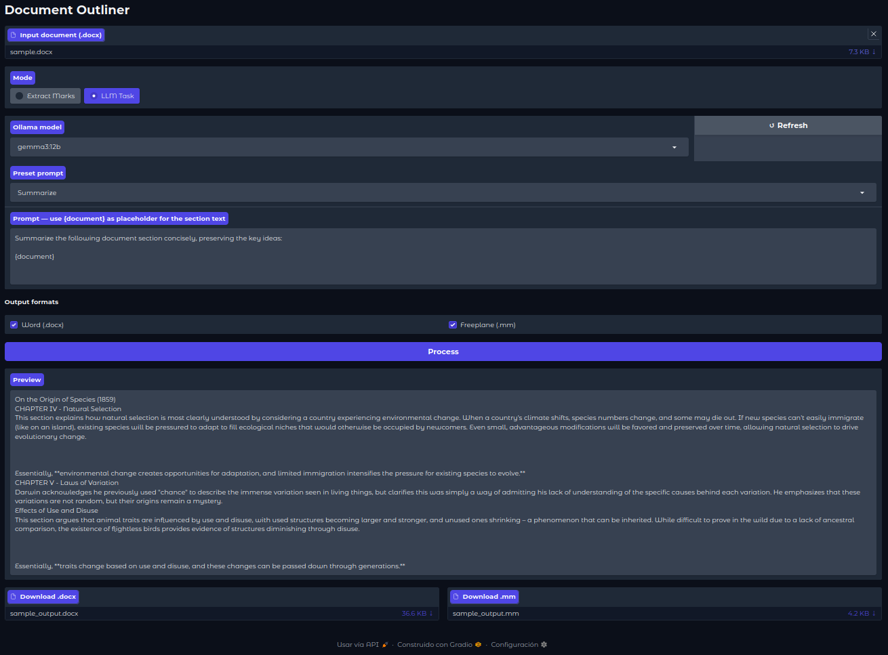
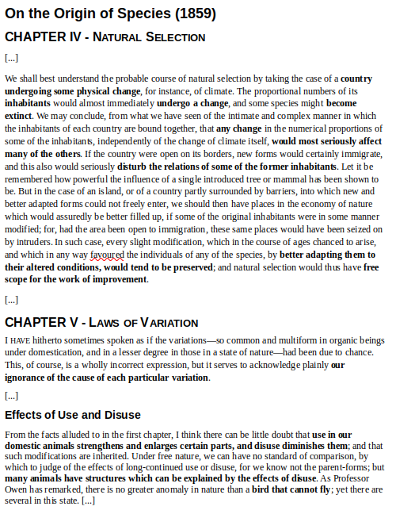
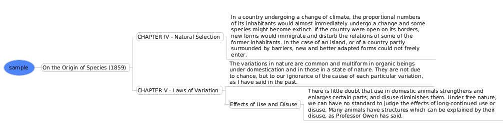
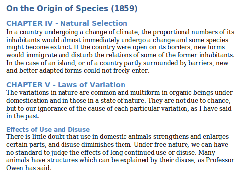
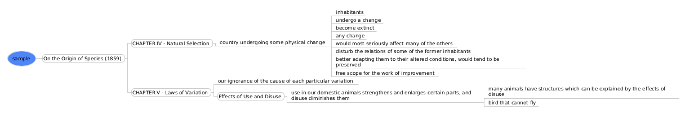
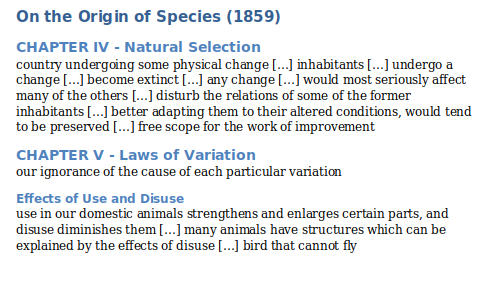

This application reads `.docx` or `.odt` documents and outputs a new document that preserves the structure (headings) but replaces content with:

1. An **LLM-generated result** for each section — summary, key points, translation, or any task defined via a custom prompt — powered by a local [Ollama](https://ollama.com/) instance. OR
2. A **compilation** of bold / italic / underlined segments annotated by the user to highlight the most relevant terms or ideas.

Multiple documents can be uploaded and processed together as a single merged document.

Output is available in two formats (one or both at the same time):

- **Document** — Word `.docx` or Markdown `.md` (when Markdown mode is enabled)
- **Outline** — concept map ([Freeplane](https://docs.freeplane.org/) `.mm`)

This project has been highly motivated by learning activities in order to avoid a second reading.

## Setup

### Virtual environment

```bash
python -m venv .venv
source .venv/bin/activate   # Windows: .venv\Scripts\activate
```

### Dependencies

```bash
pip install gradio requests python-docx freeplane-io
```

LibreOffice is required to process `.odt` files:

```bash
sudo apt install libreoffice   # Debian/Ubuntu
```

### Ollama

Requires a running Ollama instance. The recommended setup with Docker (enables browser CORS):

```bash
docker run -d --name ollama_API --restart always \
  -v ~/.IAmodels:/root/.ollama -p 11434:11434 --gpus all \
  -e OLLAMA_ORIGINS='*' ollama/ollama
```

Pull a model before using the app, e.g.:

```bash
docker exec ollama_API ollama pull llama3.2
```

## Web interface

```bash
python app.py
```

Open `http://localhost:7860` in the browser.



### Modes

**LLM Task** — select an Ollama model, choose a preset prompt or write your own using `{document}` as the placeholder for each section's text:

| Preset | Effect |
|---|---|
| Summarize | Concise summary of each section |
| Key points | Bullet list of main ideas |
| Critical analysis | Strengths and weaknesses |
| Translate to Spanish / English | Section-by-section translation |

Options:

- **Send document as Markdown** — preserves bold/italic formatting in the text sent to the model; output is saved as `.md`
- **Send full document in a single prompt** — instead of section by section, the entire document is sent in one call (useful for cross-document synthesis; requires a model with sufficient context, e.g. Gemma 3 has 128K tokens ≈ 300 dense pages)

**Extract Marks** — collects bold, italic and/or underlined runs from each paragraph.

Both output formats (Document and Outline) can be downloaded simultaneously after processing.

## Samples

### Original excerpt



### LLM Task (summarization)





### Marked words (bold, underlined)





## Command line usage

```bash
python outliner.py <input> [options]
```

| Option | Description |
|---|---|
| `-b` / `--bold` | Extract bold text |
| `-i` / `--italic` | Extract italic text |
| `-u` / `--underline` | Extract underlined text |
| `-s` / `--summary` | Generate LLM output per section |
| `-m` / `--model` | Ollama model name (default: `llama3.2`) |
| `-d` / `--docx <path>` | Document output path (file or folder) |
| `-f` / `--freeplane <path>` | Outline output path (file or folder) |
| `-r` / `--recursive` | Process subfolders (folder input only) |

### Examples

Extract bold and italic into a Freeplane outline:

```bash
python outliner.py ./data/sample.docx -b -i --freeplane ./data/output
```

Generate an LLM summary into both document and outline:

```bash
python outliner.py ./data/sample.docx -s --model llama3.2 --docx ./data/output --freeplane ./data/output
```

Batch process a folder recursively:

```bash
python outliner.py ./data -r -b -u --docx ./data/output --freeplane ./data/output
```

## TO-DO

- [x] Summarization
- [x] Local LLM via Ollama (any task via custom prompt)
- [x] Web interface (Gradio)
- [x] Italic filter
- [x] ODT document support
- [x] Multiple documents merged into one
- [x] Markdown output
- [x] Single-prompt mode (full document at once)
- [ ] Highlighted text (yellow, …)
- [ ] Use topic models
- [ ] Text to speech for more passive readings
