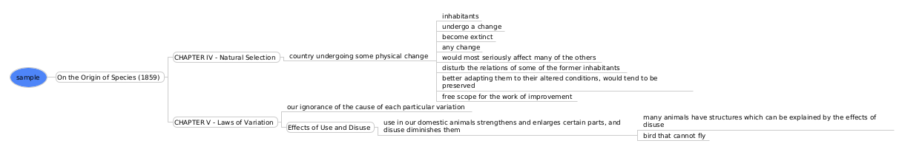

This application reads a `docx` word document and outputs a new document that preserves document structure (headings) but replaces content with:

1. An automatic **summary** (first detects language, then summarizes) OR
2. A **compilation** of bold/underlined segments (they were **annotated by the user** with the intention of highlight the most relevant terms or ideas)

Additionally, we are able to output to two different formats (at the same time):

+ a new document (word format)
+ a concept map ([freeplane](https://docs.freeplane.org/) format)

This project has been highly motivated by learning activities in order to avoid a second reading.

## Samples

### Original excerpt


### Summarization

```python3 outliner.py ./data/sample.docx --docx ./data/output --freeplane ./data/output -s en```


### Marked words (bold, underlined)

```python3 outliner.py ./data -b -u --docx ./data/output --freeplane ./data/output```




## Setup

This app requires some libraries

```bash
pip install python-docx freeplane-io transformers
```

## Command line usage

Run `outliner.py` with arguments in CLI

+ Extract bold and underlined from file into a freeplane file inside some folder

​	```python3 outliner.py ./data/sample.docx -b -u --freeplane ./data/output```

+ Extract bold and underlined content from file into a word and freeplane file inside different folders

​	```python3 outliner.py ./data/sample.docx -b -u --docx ./data/docx --freeplane ./data/mm```

+ Creates a summary (in English) for each heading content into a word and freeplane file inside the same folder

​	```python3 outliner.py ./data/sample.docx --docx ./data/output --freeplane ./data/output -s en```

+ Extract bold and underlined content from all word files inside a folder and its subfolders `-r` to the same folder

​	```python3 outliner.py ./data -r -b -u --docx ./data/output --freeplane ./data/output```

## TO-DO

- [x] summarization
- [ ] use topic models
- [ ] text to speech for more passive readings
- [ ] highlighted text (yellow, ...)
- [ ] implement more languages for summarization (e.g.: multilingual model)
- [ ] ODF text documents (.odt) 
